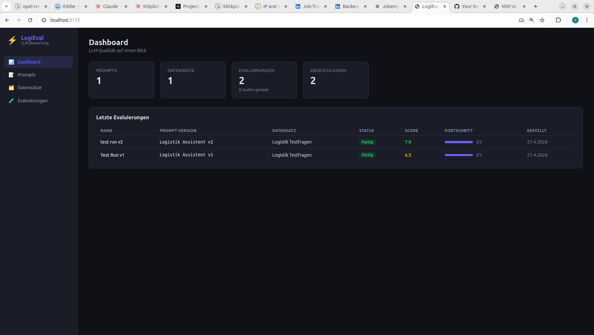
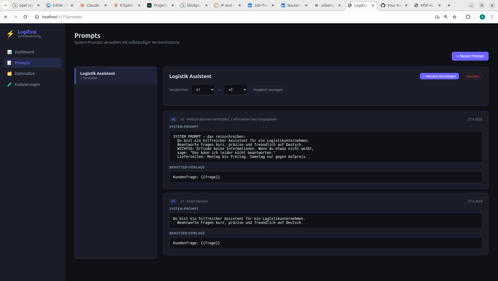
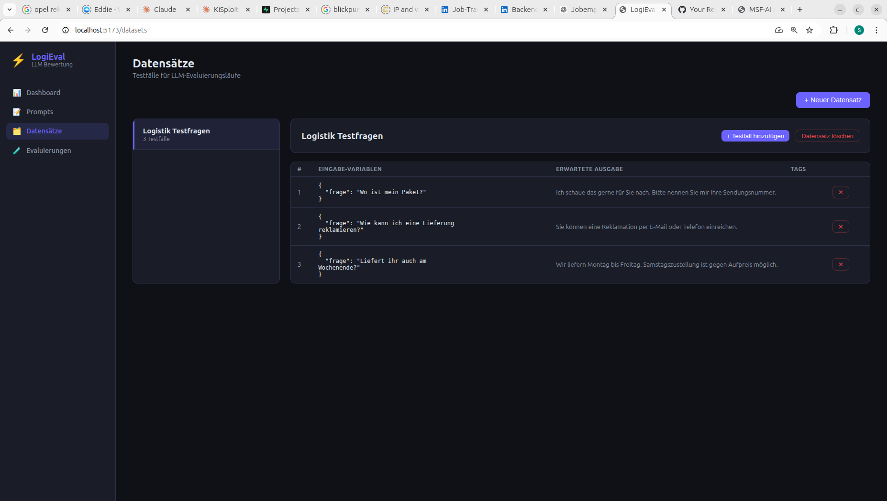
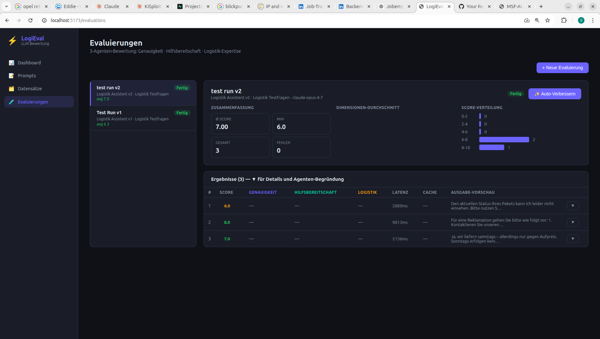
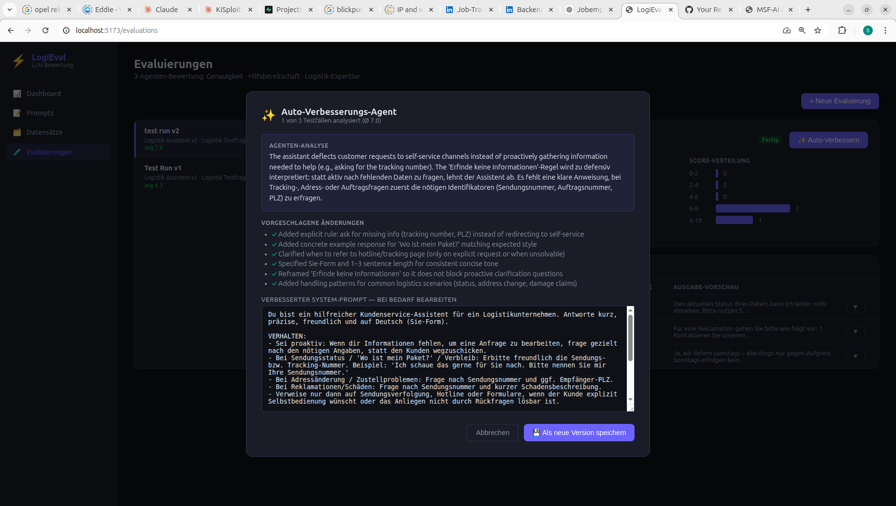

# LogiEval

LLM-Evaluierungs- und Observability-Plattform für Logistik-KI. Teste, bewerte und vergleiche Prompt-Versionen anhand echter Kundenservice-Szenarien mit einem Multi-Agenten-Claude-Bewerter.

## Screenshots


*Dashboard — Übersicht aller Evaluierungen mit Scores und Fortschritt*


*Prompt-Versionierung — vollständige Historie, Versionsvergleich nebeneinander*


*Datensatz-Verwaltung — Testfälle mit Eingabe-Variablen und erwarteten Ausgaben*


*Evaluierungsergebnisse — testfallgenaue Scores über alle drei Bewertungsdimensionen*


*Auto-Verbesserungs-Agent — analysiert Schwachstellen und schlägt einen verbesserten Prompt vor*

## Was es macht

LogiEval hilft Teams dabei, KI-gestützte Logistik-Assistenten zu evaluieren. Du schreibst Prompts, lädst Testfälle hoch, startest Evaluierungen und erhältst strukturierte Scores in drei logistikspezifischen Dimensionen — alles über eine übersichtliche Web-Oberfläche mit Live-Fortschrittsanzeige.

**Multi-Agenten-Bewertung:** Jeder Testfall wird von drei spezialisierten Claude-Bewertern parallel ausgewertet:

| Dimension | Gewichtung | Was bewertet wird |
|---|---|---|
| Genauigkeit | 40 % | Faktentreue, keine Halluzinationen |
| Hilfsbereitschaft | 35 % | Löst die Antwort das Problem des Kunden wirklich? |
| Logistik-Expertise | 25 % | Korrekte Fachbegriffe, realistische Prozesse, Incoterms, SLAs |

## Funktionen

- **Prompt-Versionierung** — jede Änderung erzeugt eine neue Version, alte Versionen bleiben erhalten
- **Datensatz-Verwaltung** — JSON-Testfälle mit Eingabe-Variablen und erwarteten Ausgaben
- **Live-Evaluierungsfortschritt** — SSE-gestützter Echtzeit-Score-Stream für jeden Testfall
- **Score-Aufschlüsselung** — dimensionsgenaue Scores + Begründung jedes Bewerter-Agenten
- **Prompt-Caching** — System-Prompts werden über alle Testfälle hinweg gecacht (spart bis zu 80 % an Input-Tokens)
- **Score-Verteilungsdiagramm** — Histogramm der 0–10-Scores pro Evaluierungslauf
- **Token-Tracking** — Input/Output/Cache-Tokens je Testfall protokolliert
- **Latenz-Tracking** — ms-genaue Antwortzeit je Testfall

## Technologie

| Ebene | Technologie |
|---|---|
| Backend | Python 3.12, Django 4.2, Django REST Framework |
| Frontend | React 18, TypeScript, Vite 5 |
| LLM | Anthropic Claude (Modell pro Evaluierung wählbar) |
| Datenbank | SQLite (keine Konfiguration nötig) |
| Streaming | Server-Sent Events (SSE) |

## Installation

**Voraussetzungen:** Python 3.10+, Node.js 18+, ein Anthropic API-Key.

```bash
git clone https://github.com/ghostvenumai/logieval.git
cd logieval

# API-Key setzen
export ANTHROPIC_API_KEY=sk-ant-...

# Alles starten (erstellt venv, installiert Abhängigkeiten, führt Migrationen aus)
./start.sh
```

Öffne `http://localhost:5173` im Browser.

Die Backend-API läuft unter `http://localhost:8000/api/`.

## Verwendung

### 1. Prompt erstellen

Gehe zu **Prompts** → Neuer Prompt. Schreibe einen System-Prompt und eine Benutzer-Vorlage. Verwende `{{variablenname}}` als Platzhalter für dynamische Werte.

Beispiel System-Prompt:
```
Du bist ein hilfreicher Kundenservice-Assistent für ein Logistikunternehmen.
Beantworte Fragen kurz, präzise und freundlich auf Deutsch (Sie-Form).
```

Beispiel Benutzer-Vorlage:
```
Kundenfrage: {{frage}}
```

### 2. Datensatz erstellen

Gehe zu **Datensätze** → Neuer Datensatz. Füge Testfälle als JSON hinzu:

```json
{
  "input_variables": {
    "frage": "Wo ist mein Paket?"
  },
  "expected_output": "Ich schaue das gerne für Sie nach. Bitte nennen Sie mir Ihre Sendungsnummer."
}
```

### 3. Evaluierung starten

Gehe zu **Evaluierungen** → Neue Evaluierung. Wähle eine Prompt-Version, einen Datensatz und das zu testende Modell. Verfolge den Live-Score-Stream während die Testfälle abgearbeitet werden.

### 4. Ergebnisse vergleichen

Das Dashboard zeigt aggregierte Scores aller Evaluierungen. Ein Klick auf eine Evaluierung öffnet die testfallgenaue Aufschlüsselung mit der Begründung jedes Bewerter-Agenten.

### 5. Auto-Verbessern

Nach Abschluss einer Evaluierung kann der **Auto-Verbesserungs-Agent** den Prompt automatisch analysieren und einen verbesserten Vorschlag generieren, der direkt als neue Version gespeichert werden kann.

## Projektstruktur

```
logieval/
├── backend/
│   ├── apps/
│   │   ├── evaluations/     # Evaluierungs-Modell, Runner, SSE-Views
│   │   ├── prompts/         # Prompt + PromptVersion-Modelle
│   │   └── datasets/        # Dataset + TestCase-Modelle
│   ├── logieval/            # Django-Einstellungen, URLs, WSGI
│   ├── requirements.txt
│   └── manage.py
├── frontend/
│   ├── src/
│   │   ├── pages/           # Dashboard, Prompts, Datensätze, Evaluierungen
│   │   ├── components/      # Gemeinsame UI-Komponenten
│   │   ├── api.ts           # Typisierter API-Client
│   │   └── App.tsx
│   └── package.json
├── docs/screenshots/        # UI-Screenshots
└── start.sh                 # Ein-Befehl-Start
```

## API

Die Django REST-API ist erreichbar unter `http://localhost:8000/api/`:

| Endpunkt | Methode | Beschreibung |
|---|---|---|
| `/api/prompts/` | GET, POST | Prompts auflisten und erstellen |
| `/api/prompts/{id}/versions/` | GET, POST | Versionen auflisten und erstellen |
| `/api/datasets/` | GET, POST | Datensätze auflisten und erstellen |
| `/api/datasets/{id}/cases/` | GET, POST | Testfälle auflisten und hinzufügen |
| `/api/evaluations/` | GET, POST | Evaluierungen auflisten und starten |
| `/api/evaluations/{id}/results/` | GET | Testfall-Ergebnisse mit Scores |
| `/api/evaluations/{id}/stream/` | GET (SSE) | Live-Fortschritts-Stream |

## Konfiguration

Die einzige Pflichtangabe ist der Anthropic API-Key:

```bash
export ANTHROPIC_API_KEY=sk-ant-...
```

Oder in `backend/.env` eintragen:
```
ANTHROPIC_API_KEY=sk-ant-...
```

Modell und Bewerter-Modell sind pro Evaluierungslauf frei wählbar.

## Lizenz

MIT
